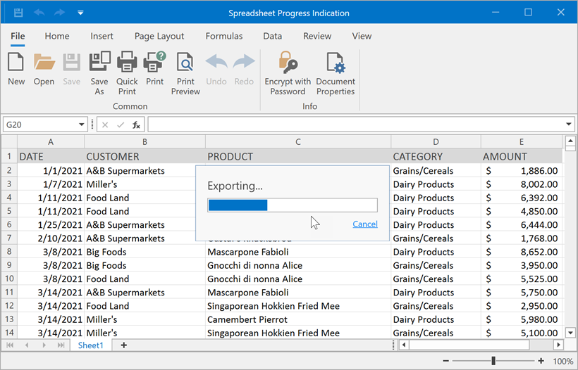

<!-- default badges list -->

<!-- default badges end -->

# WPF Spreadsheet - How to Create a Custom Progress Indicator

This example demonstrates how to use a custom [splash screen](https://docs.devexpress.com/WPF/401685/controls-and-libraries/windows-and-utility-controls/splash-screen-manager) to indicate the progress of lengthy operations (file load/save operations and export to PDF/HTML).

Use [IProgressIndicationService](https://docs.devexpress.com/CoreLibraries/DevExpress.Services.IProgressIndicationService) to create a custom progress indicator. Create a class that implements this interface and pass a class instance to the [SpreadsheetControl.ReplaceService](https://docs.devexpress.com/WPF/DevExpress.Xpf.Spreadsheet.SpreadsheetControl.ReplaceService--1(--0)) method to replace the default progress indication service with your own service.

# Files to Review

* [CustomSplashScreen.xaml](./CS/WpfSpreadsheetProgressSample/CustomSplashScreen.xaml) (VB: [CustomSplashScreen.xaml](./VB/WpfSpreadsheetProgressSample/CustomSplashScreen.xaml))
* [CustomSplashScreen.xaml.cs](./CS/WpfSpreadsheetProgressSample/CustomSplashScreen.xaml.cs) (VB: [CustomSplashScreen.xaml.vb](./VB/WpfSpreadsheetProgressSample/CustomSplashScreen.xaml.vb))
* [MainWindow.xaml.cs](./CS/WpfSpreadsheetProgressSample/MainWindow.xaml.cs) (VB: [MainWindow.xaml.vb](./VB/WpfSpreadsheetProgressSample/MainWindow.xaml.vb))

## Documentation

- [Create a Custom Progress Indicator for the Spreadsheet Control](https://docs.devexpress.com/WPF/403147/controls-and-libraries/spreadsheet/getting-started/create-a-custom-progress-indicator-for-the-spreadsheet)
<!-- feedback -->
## Does this example address your development requirements/objectives?

 

(you will be redirected to DevExpress.com to submit your response)
<!-- feedback end -->
